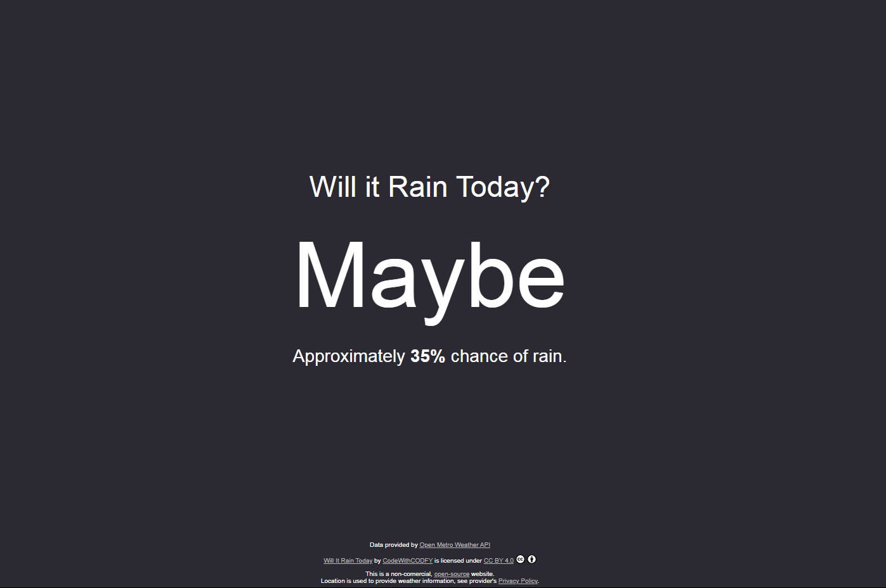

# Will It Rain Today - a rain forcasting website
> A simple website to know Will It Rain Today.
<!-- > Live demo [_here_](https://www.example.com). -->

## Table of Contents
* [General Info](#general-information)
* [Technologies Used](#technologies-used)
* [Feature](#feature)
* [Screenshots](#screenshots)
* [Setup](#setup)
* [Project Status](#project-status)
* [Acknowledgements](#acknowledgements)
* [Contact](#contact)
* [License](#license)

## General Information
- To know Will It Rain Today.

## Technologies Used
- HTML5
- CSS
- Javascript

## Feature
- Check Will It Rain Today

## Screenshots

## Setup
Just accept the permission
And you'r all set.

## Project Status
Project is: _complete_

## Acknowledgements
- Many thanks to Dountask

## Contact
Created by [@CodeWithCODFY](https://github.com/CodeWithCODFY) - feel free to contact me!

## License
This project is open source and available under the CC BY 4.0.

